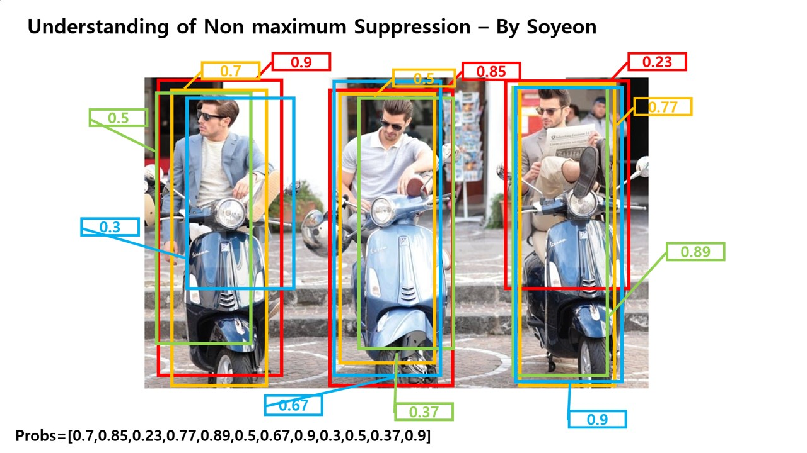
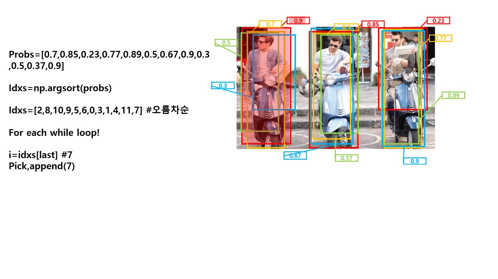
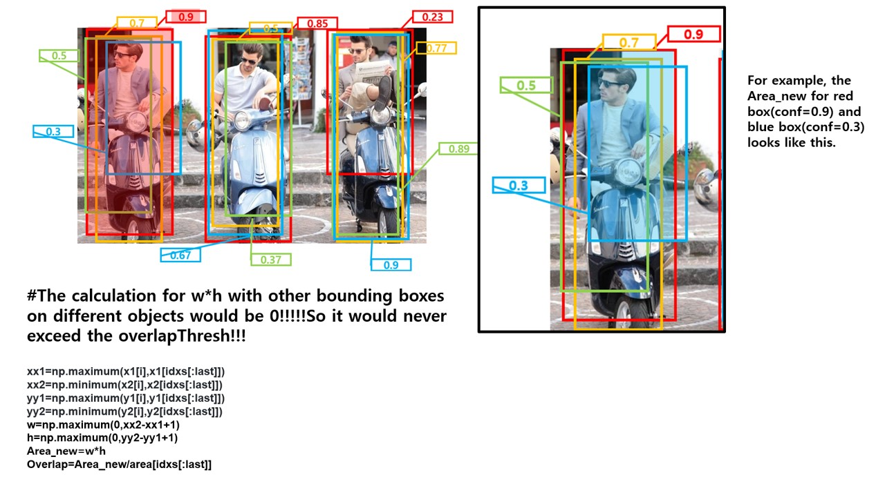
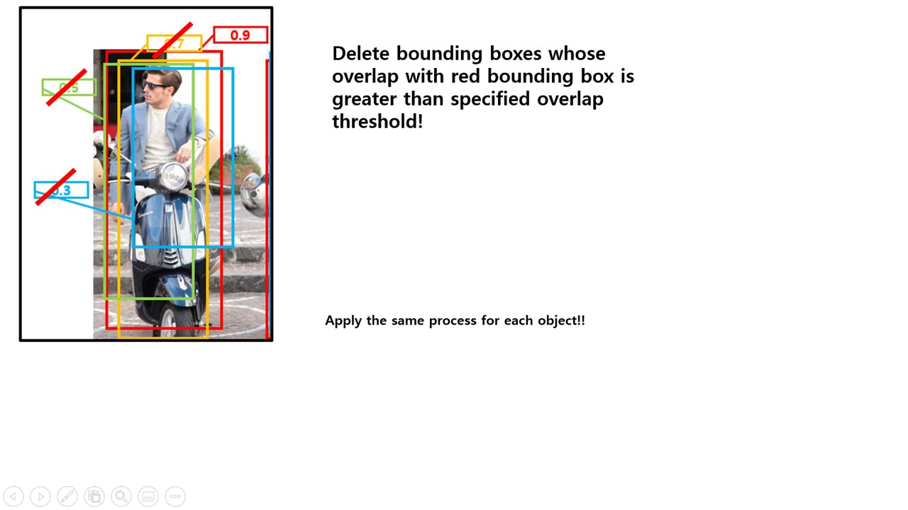

# raspberry-pi-object-tracking
Implementation of object tracking on raspberry pi using Mobilenet SSD, NMS function, and traking library.


## This project is composed of three parts
### 1. Object Detection on Raspberry Pi using tensorflow lite Mobilenet SSD 
### 2. Non Maximum Suppression on outputs of Mobilenet SSD 
### 3. Object tracking using motpy library 

__Original project's result__   


__After applying Non Maximum Suppression__


__After applying Tracking algorithm__


**Credited by**        

Object detection : https://github.com/EdjeElectronics/TensorFlow-Lite-Object-Detection-on-Android-and-Raspberry-Pi/blob/master/Raspberry_Pi_Guide.md   
Non Maximum Suppression : https://www.pyimagesearch.com/2015/02/16/faster-non-maximum-suppression-python/   
Tracking : using motpy library using the command "pip install motpy"

**The purpose of this project:**      

I am currently developing wearable devices for certain targets(people) to give them  very meaningful informations by analyzing their surroundings. To understand surroundings, visual informations are inevitable (visusal system is the most powerful system among sensory systems) and there are a number of models imitating human visual system.    I chose Mobilenet SSD for object detection because it is suitable for real time object detection on edge device(raspberry pi's picam). Object detection using Mobilenet ssd was referred from (https://github.com/EdjeElectronics/TensorFlow-Lite-Object-Detection-on-Android-and-Raspberry-Pi/blob/master/Raspberry_Pi_Guide.md) ,however, the result of original project seems unrefined with multiple bounding boxes on a single object and disconnected detections on a subsequent image frames.    
I have improved the project by using Non max suppression function eliminating multiple boxes on a single object and motpy library based on kalman filter tracking object in a subsequent frames.    
There are subtle changes compared with the original code. A newly added or changed parts would be stated below.    

##### 1. Object Detection on Raspberry Pi using tensorflow lite Mobilenet SSD    
You have to refer the original project's tutorial to setup an environment for object detection and to install the  TFLITE model provided by Google.       
--> https://github.com/EdjeElectronics/TensorFlow-Lite-Object-Detection-on-Android-and-Raspberry-Pi/blob/master/Raspberry_Pi_Guide.md   

If you followed all the steps from the original project's tutorial, you would see the result like below.    

   

We can see the real time object detection in action, however, it's not what you've expected. 

It is because of untrimmed boxes which is duplicated and the flickering box on the detected object.   

To address such problems, I employed Non Maximum Suppression function and a tracking library.    

More details about Non Maximum Suppression are stated in this link : https://whatdhack.medium.com/reflections-on-non-maximum-suppression-nms-d2fce148ef0a     

More details about the kalman filter are stated in this link: https://kr.mathworks.com/videos/introduction-to-kalman-filters-for-object-tracking-79674.html    

In fact, there're some changes compared to original codes! 
For example, instead of using video instances by creting Video classes run by multi-threads, I'd just imported imutils video module to use videostream class. By using this library, codes are simplified. 

##### 2. Non Maximum Suppression on outputs of Mobilenet SSD    
I wrote a script nms.py that implement Non Maximum Suppression next to main.py! It could be used as module by simply importing NMS from nms.py!


```python
from nms import NMS

```
There are multiple modifications I made to adjust the script to be perfectly compatible with main codes. (For nms I would explain all details about codes)

- Additional parameters (modified code)
The original script's nms function only takes bounding boxes(on a single image), overlapThresh, and the size of image as parameters. In our case, however, we need classes and confidence scores info for each bounding boxes. 
```python
def NMS(boxes,classes, probs, overlapThresh,imH,imW) #nms.py
```
```python
boxes,scores,classes=NMS(boxes,classes,scores,0.5,imH,imW) #main.py
```
- Condition when there's no detection
```python
if len(boxes) == 0:
    return []
```
- Convert datatype of bbox from Integer to Float for the bunch of division 
```python
if boxes.dtype.kind == "i":
		boxes = boxes.astype("float")
```
- Denormalize bbox[x1,y1,x2,y2] (modified code)
```python
x1 = boxes[:, 1]*imW #Applied to all x1
y1 = boxes[:, 0]*imH #Applied to all y1
x2 = boxes[:, 3]*imW #Applied to all x2
y2 = boxes[:, 2]*imH #Applied to all y2
```
- Compute the area of bounding boxes and sort on confidence scores in ascending order (If no probabilities(conf scores) are provided, sort on y2 in ascending order)
```python
area = (x2 - x1+1) * (y2 - y1+1)#By adding 1, we can prevent multiplication on floating point numbers.
idxs=y2.copy()
#If probabilities are provided, sort on them instead
if probs is not None: 
    idxs=probs
#Sort in ascending order 
idxs=np.argsort(idxs) #take index of element and sort on them 
```
- Keep looping while some indices still remain in the index list 
```python
while len(idxs)>0: 
   ##grab the last index in the index list 
   ##and add the index value to the list of picked indices(pick=[])
   last=len(idxs)-1 # grab the last (It means picking up the index of box with the highest conf score)
   i=idxs[last] #i indicates the confidence score of a particular bbox
   pick.append(i)
   
   ### find the largest (x, y) coordinates for the start of the bounding box 
   ##and the smallest (x, y) coordinates for the end of the bounding box
   
   ###Explainable with the image below
   xx1=np.maximum(x1[i],x1[idxs[:last]])
   xx2=np.minimum(x2[i],x2[idxs[:last]])
   yy1=np.maximum(y1[i],y1[idxs[:last]])
   yy2=np.minimum(y2[i],y2[idxs[:last]])
   
   #Compute the width and height of the bbox
   w=np.maximum(0,xx2-xx1+1)
   h=np.maximum(0,yy2-yy1+1)
   
   #Compute the ratio of overlap 
   overlap=(w*h)/area[idxs[:last]]
   
   #Delete all indices from the index list having overlap ratio greater than 
   #specified overlap threhold
   idxs=np.delete(idxs,
    np.concatenate(([last],np.where(overlap>overlapThresh)[0])))
```





- Return chosen boxes, confidence scores, classes 
```python
return boxes[pick], probs[pick], classes[pick]
```


##### 3. Object tracking using motpy library 

I had made a vast amount of changes to original motpty library!
Modified codes would be described below. 

1. Configurations for Tracking (main.py)
Before running tracking algorithm, we have to adjust some variables to be used as input of tracker!

The format of bbox(order of columns) after applying non maximum suppression is   
[ymin,xmin,ymax,ymin]

- Change the order of columns to [xmin,ymin,xmax,ymax] widely used format which is suitable feed for tracker 


```python
#Denormalize and concatenate all columns
xmin=boxes[:,1]*imW 
xmin[xmin<1]=1
xmin=xmin.reshape((-1,1))
ymin=boxes[:,0]*imH
ymin[ymin<1]=1
ymin=ymin.reshape((-1,1))
xmax=boxes[:,3]*imW
xmax[xmax>imW]=imW
xmax=xmax.reshape((-1,1))
ymax=boxes[:,2]*imH
ymax[ymax>imH]=imH
ymax=ymax.reshape((-1,1))
    
boxes=np.concatenate((xmin,ymin,xmax,ymax),axis=1)
```
- Filter out boxes whose confidence score is lower than specified confidence score threshold
```python
boxes=[i for idx,i in enumerate(boxes) if scores[idx]>min_conf_threshold and scores[idx]<=1.0]
classes=[i for idx,i in enumerate(classes) if scores[idx]>min_conf_threshold and scores[idx]<=1.0]
scores=[i for i in scores if i >min_conf_threshold and i<=1.0]
```
2. Run tracking algorithm (main.py)
```python
detections=[Detection(box=bbox,score=sc,cl=cl) for bbox, sc, cl in zip(boxes,scores,classes)]
tracker.step(detections)#implementing tracking 
tracks=tracker.active_tracks() #return tracked objects 
```
3. Add arguments(parameter)(motpy/core.py)
The original tracking code only returns bbox and score. To know what detected object is, class information has to be specified. 

```python
 def __init__(
            self,
            box: Box,
            score: Optional[float] = None,
            cl: Optional[float] = None):
        self.box = box
        self.score = score
        self.cl = cl
```
Add class id to an output track tuple accordingly. 
```python
# Track is meant as an output from the object tracker
Track = collections.namedtuple('Track', 'id box score cl')
```
Add class parameter to an Tracker class arguments.(motpy/tracker.py)
```python
 def __init__(
            self,
            model_spec: dict = DEFAULT_MODEL_SPEC,
            dt: float = 1 / 24,
            x0: Optional[Vector] = None,
            box0: Optional[Box] = None,
            score0: float=None,
            class0: float=None,
            max_staleness: float = 12.0,
            smooth_score_gamma: float = 0.8,
            smooth_feature_gamma: float = 0.9):
        self.id = str(uuid.uuid4())
        self.model_spec = model_spec

        self.steps_alive = 1
        self.steps_positive = 1
        self.staleness = 0.0
        self.max_staleness = max_staleness

        self.update_score_fn = exponential_moving_average_fn(smooth_score_gamma)
        self.update_feature_fn = exponential_moving_average_fn(smooth_feature_gamma)

        self.score = score0
        self.feature = None
        self.cl=class0
```
Pass class parameter when creating new tracker (active_tracks function) (motpy/tracker.py)

```python
def active_tracks(self,
                      max_staleness_to_positive_ratio: float = 3.0,
                      max_staleness: float = 999,
                      min_steps_alive: int = -1) -> Sequence[Track]:
        """ returns all active tracks after optional filtering by tracker steps count and staleness """

        tracks = []
        for tracker in self.trackers:
            cond1 = tracker.staleness / tracker.steps_positive < max_staleness_to_positive_ratio  # early stage
            cond2 = tracker.staleness < max_staleness
            cond3 = tracker.steps_alive >= min_steps_alive
            if cond1 and cond2 and cond3:
                tracks.append(Track(id=tracker.id, box=tracker.box, score=tracker.score,
                                    cl=tracker.cl))
	logger.debug('active/all tracks: %d/%d' % (len(self.trackers), len(tracks)))
        return tracks
```
Update class info accordingly when updating scores and tracker!(motpy/tracker.py)
```python
def update(self, detection: Detection):
        self.steps_positive += 1

    # KF tracker update for position and size
    z = self.model.box_to_z(detection.box)
    self._tracker.update(z)
        
    self.cl=detection.cl

    self.score = self.update_score_fn(old=self.score, new=detection.score)
    #self.feature = self.update_feature_fn(old=self.feature, new=detection.feature)
```

4. Modify multiObjectTracker class's step function (step()) (motpy/tracker.py)    
Step() function is really integral component for tracking. 
It matches new detections with existing trackers, creates new trackers if necessary and performs the cleanup. 

Let's look into codes one by one
```python
#Delete detection if it contains empty bbox
detections = [det for det in detections if det.box is not None]

logger.debug('step with %d detections' % len(detections))
#Matching btw previously tracked objects and newly detected objects 
matches = self.matching_fn(self.trackers, detections)
logger.debug('matched %d pairs' % len(matches))

# all trackers: predict
for t in self.trackers:
    t.predict() #predict coordinates of bbox
    
# assigned trackers: correct
for match in matches:
    track_idx, det_idx = match[0], match[1]
    self.trackers[track_idx].update(detection=detections[det_idx])

# not assigned detections: create new trackers POF
assigned_det_idxs = set(matches[:, 1]) if len(matches) > 0 else []
for det_idx in set(range(len(detections))).difference(assigned_det_idxs):
    tracker= Tracker(box0=detections[det_idx].box,score0=detections[det_idx].score,
                              class0=detections[det_idx].cl,
                              model_spec=self.model_spec,
                              **self.tracker_kwargs)
            self.trackers.append(tracker)
# unassigned trackers
assigned_track_idxs = set(matches[:, 0]) if len(matches) > 0 else []
for track_idx in set(range(len(self.trackers))).difference(assigned_track_idxs):
            self.trackers[track_idx].stale()
# cleanup dead trackers
self.cleanup_trackers()
        
return self.active_tracks(**self.active_tracks_kwargs)
```
5. Utilize output of tracking 
```python
 for track in tracks:
        
        if True:

            # Get bounding box coordinates and draw box
            # Interpreter can return coordinates that are outside of image dimensions, need to force them to be within image using max() and min()
            
            xmin = int(track.box[0])
            ymin = int(track.box[1])
            xmax = int(track.box[2])
            ymax = int(track.box[3])
            
            frame=cv2.resize(frame,(imW,imH))
            cv2.rectangle(frame, (xmin,ymin), (xmax,ymax), (10, 255, 0), 2)

            # Draw label
            object_name = labels[int(track.cl)]
            label = '%s: %s%%' % (object_name, str(float(track.score))) # Example: 'person: 72%'
            labelSize, baseLine = cv2.getTextSize(label, cv2.FONT_HERSHEY_SIMPLEX, 0.7, 2) # Get font size
            label_ymin = max(ymin, labelSize[1] + 10) # Make sure not to draw label too close to top of window
            cv2.rectangle(frame, (xmin, label_ymin-labelSize[1]-10), (xmin+labelSize[0], label_ymin+baseLine-10), (255, 255, 255), cv2.FILLED) # Draw white box to put label text in
            cv2.putText(frame, label, (xmin, label_ymin-7), cv2.FONT_HERSHEY_SIMPLEX, 0.7, (0, 0, 0), 2) # Draw label text

```


